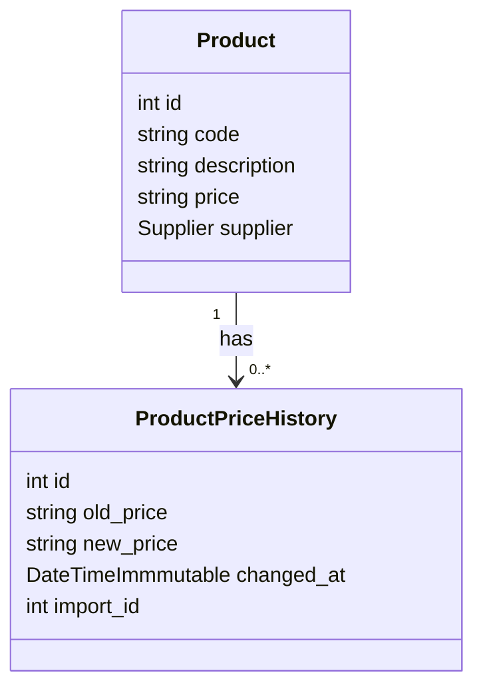

# FoodoMarkert Mercuriale

## Prérequis

Avant de commencer, assurez-vous que votre environnement dispose des éléments suivants:

- **Docker**: Version minimale requise `27.1.1`
  Vous pouvez vérifier votre version de Docker en exécutant la commande suivante:
  ```bash
  docker --version
  ```
  Sortie attendue :
  ```
  Docker version 27.1.1, build 6312585
  ```

- **GNU Make**: Version minimale requise `3.81`
  Vous pouvez vérifier votre version de Make en exécutant la commande suivante:
  ```bash
  make --version
  ```
  Sortie attendue :
  ```
  GNU Make 3.81
  Copyright (C) 2006 Free Software Foundation, Inc.
  This is free software; see the source for copying conditions.
  There is NO warranty; not even for MERCHANTABILITY or FITNESS FOR A
  PARTICULAR PURPOSE.

  This program built for i386-apple-darwin11.3.0
  ```

## Instructions pour lancer le projet

### 1. Lancer les containers Docker

Pour démarrer les containers Docker nécessaires au projet, exécutez la commande suivante :

```bash
make up
```

### 2. Initialiser le projet

Une fois les containers démarrés, initialisez le projet avec la commande suivante :

```bash
make init
```

### 3. Lancer le consumer pour traiter les messages

Pour que le consumer puisse traiter les messages dans la file d'attente, exécutez la commande suivante :

```bash
make consume
```

Cela permet de démarrer le processus de traitement des messages pour les imports de mercuriales.

### Accès aux services

- [Accéder à l'application d'import - http://localhost/](http://localhost/)
- [Accéder aux mails - http://mail.localhost/](http://mail.localhost/)

## Réponse au Bonus 2

Pour implémenter le suivi des changements de prix lors des imports de mercuriales, voici le diagramme de classe qui montre la relation entre `Product` et `ProductPriceHistory` :




## Tests

Pour lancer les tests, il faut lancer la commande

```bash
make tests
```
